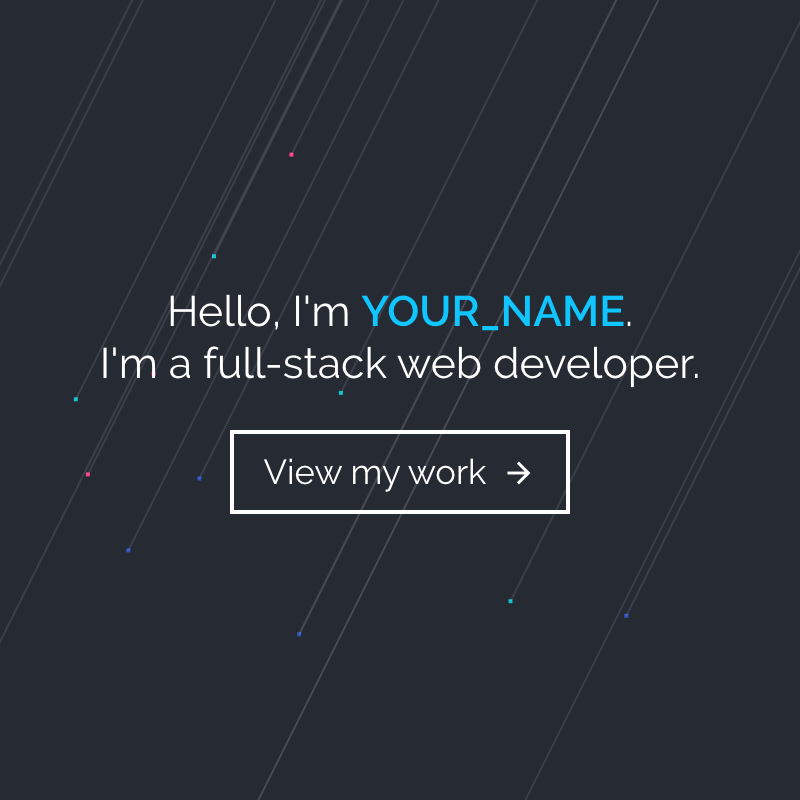

# Techover Academy - Portfolio

## Welcome Everyone! 👋

Thank you for attempting to build this project.

This project is part of the [Techover Academy](https://www.academy.techover.nu) program. Techover Academy teaches you how to become a professional developer within 4 months.

**To do this project, you need a basic understanding of HTML and CSS.**

## The Project

Your challenge is to build out this portfolio and get it looking as close to the design as possible. Any personal changes to the design is encouraged as long as the changes are intentional and not bugs.

You can use any tools you like to help you complete the project. So if you've got something you'd like to practice, feel free to give it a go.

Your users should be able to:

- See animations when scrolling
- View Previews (images + text) of your future Projects
- Download your CV
- Contact you by email if they're interested

Want some support? Ask questions in the Techover Academy Slack **#help** channel.

## Live Demo

[Want to See the Live Demo? Click here.](https://techover-portfolio.herokuapp.com/)

## Where to find everything

You will find all the required images in the `/src/img` folder.
You will find all the required scripts in the `/src/scripts` folder.
You will find all the required CSS files in the `/src/styles` folder.

There is also a `style-guide.md` file containing the information you'll need, such as color palette and fonts.

## How to run the project

1. Open up the commandline
2. Navigate to this project folder
3. Run `npm i --save`
4. Start the website by running `npm run dev`
5. Visit the website in your browser on the URL `http://localhost:3000`

## Building your project

Feel free to use any workflow that you feel comfortable with. Below is a suggested process, but do not feel like you need to follow these steps:

1. Look through the Live Demo to start planning out how you'll tackle the project. This step is crucial to help you think ahead for CSS classes to create reusable styles.
2. Before adding any styles, structure your content with HTML. Writing your HTML first can help focus your attention on creating well-structured content.
3. Write out the base styles for your project, including general content styles, such as `font-family` and `font-size`.
4. Start adding styles to the top of the page and work down. Only move on to the next section once you're happy you've completed the area you're working on.

## Deploying your project

As mentioned above, there are many ways to host your project for free. Our recommend hosts are:

- [Heroku](https://heroku.com/)
- [Netlify](https://www.netlify.com/)

You can host your site using one of these solutions or any of our other trusted providers.

## Create a custom `README.md`

We strongly recommend overwriting this `README.md` with a custom one. We've provided a template inside the [`README-template.md`](./README-template.md) file in this starter code.

The template provides a guide for what to add. A custom `README` will help you explain your project and reflect on your learnings. Please feel free to edit our template as much as you like.

Once you've added your information to the template, delete this file and rename the `README-template.md` file to `README.md`. That will make it show up as your repository's README file.

## Submitting your solution

When you're done, contact your coach (Marcus or Matt) and send them a link to your Github Repository with this README. Make sure you have a Live Demo linked in your README.

Remember, if you're looking for feedback on your solution, be sure to ask questions when submitting it. The more specific and detailed you are with your questions, the higher the chance you'll get valuable feedback from the community.

**Have fun building!** 🚀
